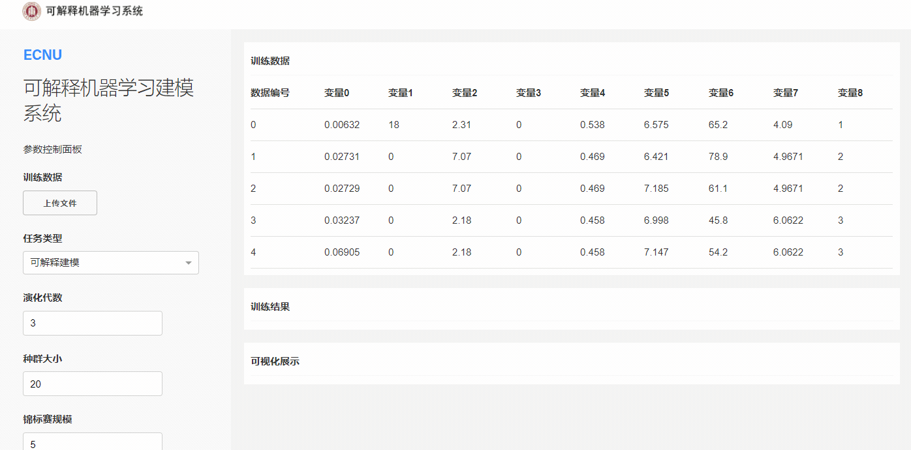

# Evolutionary Machine Learning Platform

Evolutionary machine learning (EML) algorithm is an emerging domain with plenty of existing results. In order to facilitate the development of EML, we developed a platform to allow anyone to use EML algorithms with no code.

## Introduction

This package is mainly focus on providing a user-friendly platform for EML techniques. It includes following of algorithms:

* Evolutionary Feature Construction
    * [**Evolutionary Forest**](https://ieeexplore.ieee.org/document/9656554)
* Evolutionary Feature Selection
    * [**NSGA2**](https://ieeexplore.ieee.org/document/996017)
    * [**RM-MEDA**](https://ieeexplore.ieee.org/document/4358761)
    * [MOEA/D](https://ieeexplore.ieee.org/document/4358754)
    * [NSGA3](https://ieeexplore.ieee.org/document/6600851)
    * [C-TAEA](https://ieeexplore.ieee.org/document/8413136)
* Symbolic Regression
  * [PS-Tree](https://www.sciencedirect.com/science/article/pii/S2210650222000335)
  * gplearn

## Preview



## Usage 

```bash
# Start
python server Server.py
```