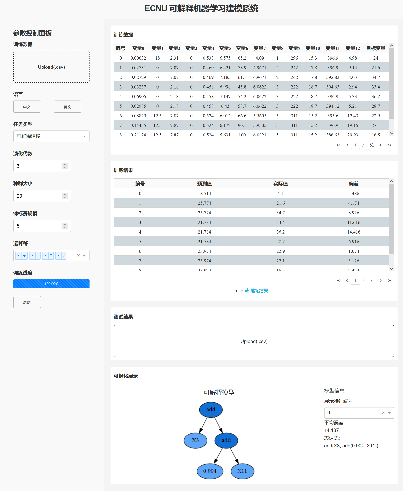
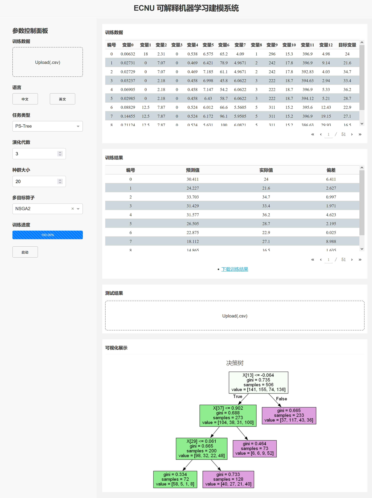
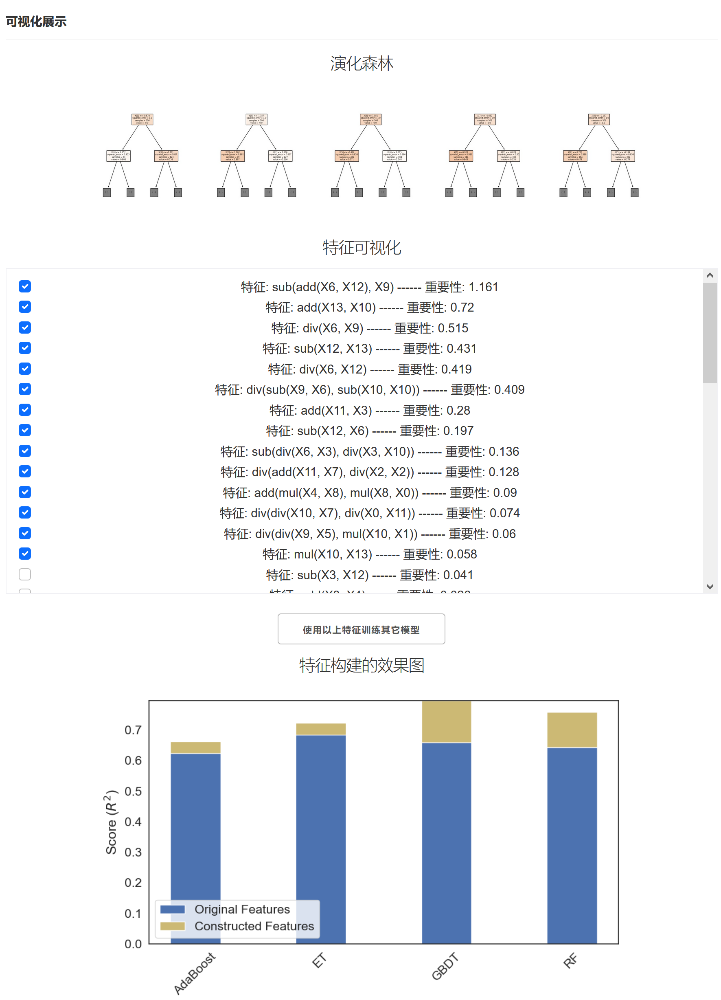
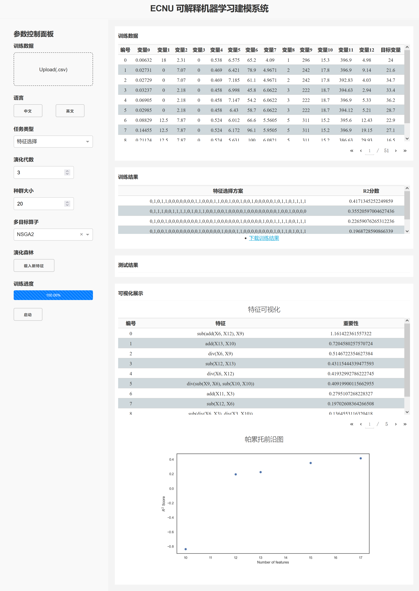

# 演化机器学习平台

演化机器学习（EML）算法是一个具有大量现有成果的新兴领域。为了促进EML的发展，我们开发了一个平台，允许任何人使用EML算法而不需要代码。

## 算法

这个软件包主要是为EML技术提供一个对用户友好的平台。它包括以下算法：

* 演化特征构造
    
    * [**Evolutionary Forest**](https://ieeexplore.ieee.org/document/9656554)
    
      [论文解析](https://www.zhihu.com/question/367337608/answer/2287992641)
    
      [开源代码（66 starred）](https://github.com/hengzhe-zhang/EvolutionaryForest)
* 演化特征选择
    * [**NSGA2**](https://ieeexplore.ieee.org/document/996017)
    * [**RM-MEDA**](https://ieeexplore.ieee.org/document/4358761)
    * [MOEA/D](https://ieeexplore.ieee.org/document/4358754)
    * [NSGA3](https://ieeexplore.ieee.org/document/6600851)
    * [C-TAEA](https://ieeexplore.ieee.org/document/8413136)
* 符号回归
  * [PS-Tree](https://www.sciencedirect.com/science/article/pii/S2210650222000335)
  
    [论文解析](https://zhuanlan.zhihu.com/p/597166524)
  
    [开源代码](https://github.com/hengzhe-zhang/PS-Tree)
  
  * [gplearn](https://github.com/trevorstephens/gplearn)

## 主界面

左侧为控制栏，右侧显示结果和数据。


## 功能说明

### 训练数据上传

训练数据可以拖动到虚线框内，或者通过点击的方式上传，目前只支持csv格式文件，且只支持多对一的数据（即多变量，单目标量），注意不要带有索引。

默认数据集是Boston房价，默认的测试集为训练集。

### 语言

中英文自由切换。

### 任务类型

主要用四类：可解释建模、PS-Tree、演化森林、特征选择。

#### **可解释建模：**

本项功能的实现依赖于gplearn开源代码库。

左侧可选择演化代数、种群大小、锦标赛规模、运算符。

右侧显示：

- 训练结果：可下载
- 测试数据的上传框（上传要求同训练数据）：可上传测试集进行预测或者检验误差
- 可视化展示：显示可解释模型，主要包括符号树、特征表达式、平均误差



#### PS-Tree

左侧可选择演化代数、种群大小、多目标算子。

右侧显示：

- 其它内容同上
- 可视化展示：显示决策树模型



#### 演化森林

左侧可选择演化代数、种群大小。

右侧显示：

- 其它内容同上
- 可视化展示：显示演化森林模型、构造的特征及重要性（**重要性是决策树自动给出的**），可以选择top特征训练其他模型，展示训练结果



#### 特征选择

左侧可选择演化代数、种群大小、多目标算子、载入演化森林特征。

- 载入演化森林特征：载入演化森林训练生成的新特征，自动选择特征方案，方便用户使用（注意，使用前需先用演化森林生成新特征）

右侧显示：

- 训练结果为选择的特征方案
- 可视化展示：帕累托前沿图



### 多目标算子

- PS-Tree：NSGA-2、NSGA-3、Lexicase、IBEA、SPEA2
- 特征选择：NSGA-2、NSGA-3、MOEA/D、RM-MEDA、C-TAEA

### 训练结果

前三种任务类型显示的是预测值、实际值和偏差。第四种显示的是特征选择方案。

训练结果支持下载。

### 测试结果

用户可上传测试数据，格式要求与上传训练数据一致。

如果上传的是没有实际值的数据集，那么就预测结果；如果是有实际值，那么就预测结果并计算偏差。

### 可视化展示

不同任务类型的展示内容不同，上面已经有了介绍。

这里特别针对演化森林模型做出介绍，当训练好模型后，新的特征会被展示，用户可以选择特征并训练其他模型。

## 使用

推荐使用Pycharm，也可用其它编辑器，运行Server.py即可。

```bash
# Start
python server Server.py
```

默认URL: http://127.0.0.1:8050/

可在主程序中修改。

